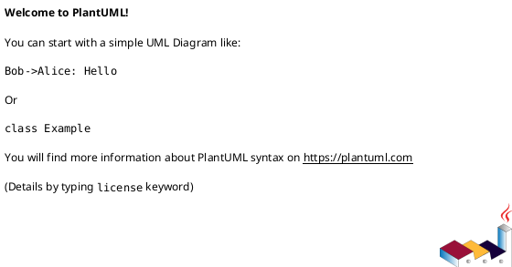

# Workflow Orchestrator v2.0

**Propósito:** Esta skill define dois modos de operação para desenvolvimento de jogos:
1. **Corporate Protocol** - Workflow completo com sátira corporativa, múltiplos stakeholders e documentação rica
2. **Lone Wolf** - Workflow simplificado para desenvolvimento solo sem burocracia excessiva

**Stack Alvo:** Zig + Raylib + Nuklear + SDL2 (mas agnóstico o suficiente para outras stacks)

---

## 1. Visão Geral dos Workflows

### 1.1 Comparação Rápida

| Característica | Corporate Protocol | Lone Wolf |
|----------------|-------------------|-----------|
| **Complexidade** | Alta (teatral, múltiplos docs) | Baixa (direto ao ponto) |
| **Stakeholders** | 11 personas satíricas | 1 (você em 4 modos) |
| **Documentação** | RRA + PlantUML + Memos + Drift Reports | Backlog simples + Notes |
| **Reuniões** | Sprint Planning/Retro transcriptas | Auto-reflexão rápida |
| **Dívida Técnica** | TD/PD categorizados com links | Lista simples de issues |
| **POCs** | Playground obrigatório + validação | POC opcional para features complexas |
| **Ideal para** | Projetos grandes, equipes, diversão | Prototipagem rápida, solo dev |

### 1.2 Quando Usar Cada Workflow

**Use Corporate Protocol quando:**
- ✅ Trabalhando em equipe (mesmo que pequena)
- ✅ Projeto de longo prazo (> 3 meses)
- ✅ Múltiplas features interdependentes
- ✅ Quer manter consistência arquitetural rigorosa
- ✅ A sátira corporativa aumenta sua produtividade

**Use Lone Wolf quando:**
- ✅ Desenvolvimento solo
- ✅ Prototipagem rápida / game jams
- ✅ Features isoladas e simples
- ✅ Prazos apertados
- ✅ Quer focar em código, não documentação

---

## 2. Corporate Protocol Workflow

### 2.1 Estrutura de Diretórios

```
docs/
├── architecture/
│   ├── backlog.md                    # Backlog central (RRAs)
│   ├── technical_debt.md             # TD/PD register
│   ├── principles.md                 # Princípios de design
│   └── ubiquitous_language.md        # Linguagem do domínio
│
├── domain/
│   ├── entities.md                   # Definições SoA/ECS
│   ├── characters/                   # Perfis de personagens
│   │   └── [name].md
│   └── mechanics/
│       ├── [mechanic_name]/
│       │   ├── [mechanic_name].md    # Spec principal
│       │   ├── architecture/
│       │   └── system/
│       │       └── [system]/
│       │           ├── README.md
│       │           └── structure.md
│
├── editors/features/
│   └── [feature_name]/
│       ├── RRA-XXX_feature.md
│       └── core_mechanics/
│
├── reports/
│   └── YYYY/
│       └── MM/
│           ├── YYYY-MM-DD_HHMM_RRA-XXX_impl.md
│           ├── YYYY-MM-DD_HHMM_drift_report.md
│           ├── YYYY-MM-DD_HHMM_sprint_N_planning.md
│           ├── YYYY-MM-DD_HHMM_sprint_N_retro.md
│           └── YYYY-MM-DD_HHMM_MEMO_theme.md
│
└── voxel-editor/ (ou outro editor específico)
    ├── user_manual.md
    └── compliance_report.md
```

### 2.2 Processo de Requisição (RRA)

**Passo 1: Draft da Requisição**

Use o template `templates/requisition_form.md`:

```markdown
# REQUISITION FOR RESOURCE ALLOCATION (RRA-XXX)
**Status**: DRAFT / PENDING REVIEW
**Approver**: [USER]

## 1. Executive Summary
[Justificativa de 2-3 parágrafos]

## 2. Architecture Views (PlantUML)


<details><summary>PlantUML Source</summary>



</details>

## 3. Technical Justification
- **Allocators impacted**: [Arena / GPA / Pool]
- **DOD impact**: [SoA updates / System changes]
- **Drift Check**: [Impacto em constraints de design]

## 4. Stakeholder Commentary

| Stakeholder | Commentary | Sentimento |
|-------------|------------|------------|
| **The Architect** | "..." | 😐 / 😠 / 😄 |
| **Corporate HR** | "..." | 😐 / 😠 / 😄 |
| **The Junior Dev** | "..." | 😐 / 😠 / 😄 |
| **The Vibe Curator** | "..." | 😐 / 😠 / 😄 |
| **The Retro Purist** | "..." | 😐 / 😠 / 😄 |
| **The Engine Purist** | "..." | 😐 / 😠 / 😄 |
| **The Avid Player** | "..." | 😐 / 😠 / 😄 |
| **CEO** | "..." | 😐 / 😠 / 😄 |
| **UX Lead** | "..." | 😐 / 😠 / 😄 |
| **Lawyer** | "..." | 😐 / 😠 / 😄 |
| **Lead Engineer** | "..." | 😐 / 😠 / 😄 |

## 5. Implementation Timeline (Sprints)
- **Sprint 1**: [Fundação / POC]
- **Sprint 2**: [Refinamento / Integração]
- **Sprint 3**: [Polimento / Drift Analysis]
```

**Passo 2: Renderizar PlantUML**

```bash
plantuml -tpng docs/path/to/diagram.puml
```

**Passo 3: Adicionar ao Backlog**

Edite `docs/architecture/backlog.md`:

```markdown
## 📥 Pending Requisitions
- [ ] **RRA-XXX**: [Título da Feature]

## 📁 Audit Trail (Completed)
- [x] **RRA-YYY**: [Feature Completa]
```

### 2.3 Sprint Planning

**Template:** `templates/sprint_planning.md`

```markdown
# Sprint N Planning Session
**Date**: YYYY-MM-DD
**Attendees**: [Lista de stakeholders]

## 1. Backlog Review

### Active Technical Debt
| ID | Description | Severity | Priority |
|----|-------------|----------|----------|
| TD-001 | ... | HIGH | 🔴 |

### Active Product Debt
| ID | Description | Severity | Priority |
|----|-------------|----------|----------|
| PD-001 | ... | MEDIUM | 🟡 |

### Pending Requisitions
| ID | Description | Effort | Value |
|----|-------------|--------|-------|
| RRA-XXX | ... | High | High |

## 2. Sprint Goals

**Primary Objective**: [Objetivo principal]

**Secondary Objectives**:
- [ ] [Objetivo 1]
- [ ] [Objetivo 2]

## 3. Resource Allocation

| Task | Owner | Estimated Effort |
|------|-------|------------------|
| [Task 1] | [Dev] | [X dias] |
| [Task 2] | [Dev] | [X dias] |

## 4. Stakeholder Debate Transcript

**The Architect**: "..."

**Corporate HR**: "..."

**The Vibe Curator**: "..."

**The Junior Dev**: "..."

## 5. Managerial Sign-Off

| Role | Name | Approval | Date |
|------|------|----------|------|
| Lead Architect | [Name] | ✅ / ❌ | YYYY-MM-DD |
| Product Owner | [Name] | ✅ / ❌ | YYYY-MM-DD |
```

### 2.4 Implementation Report (Pré-Código)

**Template:** `templates/implementation_report.md`

```markdown
# Implementation Report: RRA-XXX
**Date**: YYYY-MM-DD HH:MM
**Author**: [Dev Name]

## 1. Technical Approach

### Memory Model
- **Primary Allocator**: [Arena/GPA/Pool]
- **Expected Allocations**: [N por frame]
- **Deallocation Strategy**: [Frame reset / Manual]

### DOD Considerations
- **SoA Structures**: [Quais structs serão SoA]
- **Cache Locality**: [Como dados serão acessados]
- **System Boundaries**: [Onde cada sistema começa/termina]

### Drift Check
- **Vibe Compliance**: [Como mantém estética retro]
- **Engine Constraints**: [Limitações do raycasting/2.5D]
- **Editor Separation**: [O que é engine vs editor]

## 2. Implementation Plan

### Phase 1: Foundation
- [ ] [Task 1.1]
- [ ] [Task 1.2]

### Phase 2: Integration
- [ ] [Task 2.1]
- [ ] [Task 2.2]

### Phase 3: Validation
- [ ] [POC/Testes]
- [ ] [Drift Analysis]

## 3. Risk Assessment

| Risk | Likelihood | Impact | Mitigation |
|------|------------|--------|------------|
| [Risk 1] | Low/Med/High | Low/Med/High | [Mitigation] |

## 4. Success Criteria

- [ ] [Critério 1]
- [ ] [Critério 2]
- [ ] [Critério 3]
```

### 2.5 Drift Analysis Report

**Template:** `templates/drift_report.md`

```markdown
# Architectural Drift Report
**Date**: YYYY-MM-DD HH:MM
**Cycle**: [Nome do Ciclo/Sprint]
**Focus**: [Tópico principal]

## 1. Executive Summary

[Visão geral de 2-3 parágrafos]

**Impact Level**: LOW / MEDIUM / HIGH / CRITICAL

## 2. Fragmentation Analysis

### 2.1 Directory Structure Audit

| Before | After | Status |
|--------|-------|--------|
| [Path A] | [Path B] | ✅ / ⚠️ / ❌ |

### 2.2 Code Duplication Check

- [ ] Lógica duplicada detectada?
- [ ] Gerenciamento de memória ad-hoc?
- [ ] Overlap entre módulos?

### 2.3 Skill Compliance

| Skill | Compliance | Notes |
|-------|------------|-------|
| tech_stack_zig_raylib | ✅ / ❌ | [Notes] |
| style_guide_retro_fps | ✅ / ❌ | [Notes] |
| game_mechanics_dod | ✅ / ❌ | [Notes] |

## 3. Vibe Drift Analysis

### 3.1 Retro-Fidelity Check

| Constraint | Status | Notes |
|------------|--------|-------|
| Resolução interna (320x200) | ✅ / ❌ | |
| Paleta 8-bit / 256 cores | ✅ / ❌ | |
| UI estilo 90s | ✅ / ❌ | |
| Zero modernisms | ✅ / ❌ | |

### 3.2 Modernism Detection

| Modernism | Detected? | Action |
|-----------|-----------|--------|
| Anti-aliasing | ❌ | N/A |
| High-poly models | ❌ | N/A |
| PBR materials | ❌ | N/A |
| 16:9 nativo | ❌ | N/A |

## 4. Backlog Reconciliation

### 4.1 Completed Items

| ID | Description | Status |
|----|-------------|--------|
| RRA-XXX | [Feature] | ✅ DONE |

### 4.2 Pending Requisitions (No Change)

| ID | Description | Priority |
|----|-------------|----------|
| RRA-YYY | [Feature] | HIGH |

## 5. Compliance Review

### 5.1 Against Principles

| Principle | Compliance | Notes |
|-----------|------------|-------|
| Data-Oriented Design | ✅ / ❌ | |
| Explicit Memory Mgmt | ✅ / ❌ | |
| Engine/Editor Separation | ✅ / ❌ | |
| Retro-First Aesthetic | ✅ / ❌ | |

### 5.2 Against Skills

| Skill Rule | Compliance | Notes |
|------------|------------|-------|
| [Rule 1] | ✅ / ❌ | |
| [Rule 2] | ✅ / ❌ | |

## 6. Debt Stratification

### 6.1 Technical Debt (NEW)

| ID | Description | Origin | Severity |
|----|-------------|--------|----------|
| TD-XXX | [Descrição] | [Drift Report YYYY-MM-DD] | LOW/MED/HIGH |

### 6.2 Product Debt (NEW)

| ID | Description | Origin | Severity |
|----|-------------|--------|----------|
| PD-XXX | [Descrição] | [Drift Report YYYY-MM-DD] | LOW/MED/HIGH |

### 6.3 Existing Debt (Unchanged)

| ID | Description | Status |
|----|-------------|--------|
| TD-001 | [Descrição] | OPEN |

## 7. Stakeholder Commentary (Watercooler Transcript)

**The Architect**: "..."

**The Junior Dev**: "..."

**Corporate HR**: "..."

**The Vibe Curator**: "..."

**The Retro Purist**: "..."

## 8. Managerial Sign-Off

| Role | Name | Approval | Timestamp |
|------|------|----------|-----------|
| Lead Architect | [Name] | ✅ / ⏳ / ❌ | HH:MM |
| Vibe Curator | [Name] | ✅ / ⏳ / ❌ | HH:MM |
| Corporate HR | [Name] | ✅ / ⏳ / ❌ | HH:MM |

## 9. Recommended Actions

1. **[IMMEDIATE]** [Ação prioritária]
2. **[LOW PRIORITY]** [Ação secundária]
3. **[FUTURE]** [Melhoria futura]

---

**Report Generated By**: workflow_orchestrator Skill
**Compliance Status**: ✅ FULL COMPLIANCE / ⚠️ PARTIAL / ❌ NON-COMPLIANT
```

### 2.6 Sprint Retrospective

**Template:** `templates/sprint_retro.md`

```markdown
# Sprint N Retrospective and Review
**Date**: YYYY-MM-DD
**Sprint Duration**: [Start] → [End]

## 1. What Went Well ✅

- [ ] [Item 1]
- [ ] [Item 2]
- [ ] [Item 3]

## 2. What Went Spectacularly Wrong ❌

- [ ] [Falha 1]
- [ ] [Falha 2]

## 3. Code Review Summary

### Features Delivered
| RRA | Description | Status | Quality |
|-----|-------------|--------|---------|
| RRA-XXX | [Feature] | ✅ | High/Med/Low |

### Technical Debt Generated
| ID | Description | Severity |
|----|-------------|----------|
| TD-XXX | [Descrição] | LOW/MED/HIGH |

### Product Debt Generated
| ID | Description | Severity |
|----|-------------|----------|
| PD-XXX | [Descrição] | LOW/MED/HIGH |

## 4. Stakeholder Debriefing

**The Architect**: "..."

**Corporate HR**: "..."

**The Vibe Curator**: "..."

**The Junior Dev**: "..."

**The Retro Purist**: "..."

## 5. Lessons Learned

### Technical
- [Liçon 1]
- [Liçon 2]

### Process
- [Liçon 1]
- [Liçon 2]

### Vibe/Aesthetic
- [Liçon 1]
- [Liçon 2]

## 6. Managerial Sign-Off

| Role | Name | Approval | Date |
|------|------|----------|------|
| Lead Architect | [Name] | ✅ | YYYY-MM-DD |
| Product Owner | [Name] | ✅ | YYYY-MM-DD |

---

**Sprint Status**: ✅ COMPLETED / ⚠️ PARTIAL / ❌ FAILED
```

### 2.7 Corporate Memorandum (Coffee Presentation)

**Template:** `templates/memorandum.md`

```markdown
# Corporate Memorandum: [Tema]
**Date**: YYYY-MM-DD
**Classification**: CONFIDENTIAL / WATERCOOLER-ONLY

## 1. Context

[Por que este memorando está sendo escrito]

## 2. Coffee Presentation Transcript

**Setting**: [Local, hora, participantes]

**The Architect**: [Fala]

**Corporate HR**: [Resposta]

**The Junior Dev**: [Comentário ingênuo]

**The Vibe Curator**: [Obsessão estética]

**The Retro Purist**: [Reclamação de performance]

## 3. Technical Details

[Detalhes técnicos da mudança de paradigma]

### Before
```zig
// Código antigo
```

### After
```zig
// Código novo
```

## 4. Action Items

- [ ] [Item 1]
- [ ] [Item 2]

## 5. New Debt Logged

### Technical Debt
| ID | Description |
|----|-------------|
| TD-XXX | [Descrição] |

### Product Debt
| ID | Description |
|----|-------------|
| PD-XXX | [Descrição] |

## 6. Stakeholder Quotes (Para Posteridade)

> "[Quote memorável]" — The Architect

> "[Quote engraçada]" — Corporate HR

---

**Filed By**: [Name]
**Distribution**: All Hands
```

---

## 3. Lone Wolf Workflow

### 3.1 Estrutura de Diretórios Simplificada

```
docs/
├── backlog.md              # Lista de tarefas com IDs
├── tech_debt.md            # Issues conhecidas
├── principles.md           # Princípios (opcional)
└── notes/
    └── YYYY-MM-DD_desc.md  # Notas de implementação
```

### 3.2 Backlog Simplificado

**Template:** `templates/lone_wolf_backlog.md`

```markdown
# Lone Wolf Backlog

## 🎯 Current Focus
- [ ] FEAT-001: [Descrição curta]
  - [ ] Subtask 1
  - [ ] Subtask 2

## 📋 Pending
- [ ] FEAT-002: [Descrição]
- [ ] FEAT-003: [Descrição]

## 📁 Done (This Session)
- [x] FEAT-000: [Descrição]

## 🐛 Known Issues
- [ ] BUG-001: [Descrição]

## 💡 Ideas (Someday)
- [ ] IDEA-001: [Descrição]
```

### 3.2 Technical Debt Simplificado

**Template:** `templates/lone_wolf_debt.md`

```markdown
# Technical Debt

## Active Debt

| ID | Description | Origin | Effort to Fix |
|----|-------------|--------|---------------|
| DEBT-001 | [Descrição] | [FEAT-XXX] | 30 min / 1h / 2h+ |

## Paid Debt (Archive)

| ID | Description | Paid In |
|----|-------------|---------|
| DEBT-000 | [Descrição] | FEAT-000 |
```

### 3.3 Implementation Notes (Pré-Código)

**Template:** `templates/implementation_notes.md`

```markdown
# Implementation Notes: FEAT-XXX
**Date**: YYYY-MM-DD

## What
[O que vou implementar em 1-2 frases]

## Why
[Por que é necessário/útil]

## How
[Abordagem técnica em bullets]
- [ ] [Step 1]
- [ ] [Step 2]
- [ ] [Step 3]

## Memory Model
- **Allocator**: [Arena/GPA/Pool]
- **Expected allocations**: [N por frame]

## DOD Notes
- **SoA structs**: [Quais]
- **Cache patterns**: [Como acessados]

## Vibe Check
- [ ] Mantém estética retro?
- [ ] Zero modernisms?
- [ ] Performance ok?

## Risks
- [Risk 1]

## Success Criteria
- [ ] [Critério 1]
- [ ] [Critério 2]
```

### 3.4 Drift Check Rápido (Pós-Código)

**Template:** `templates/quick_drift_check.md`

```markdown
# Quick Drift Check: FEAT-XXX
**Date**: YYYY-MM-DD
**Time Spent**: 5 minutos

## Fragmentation
- [ ] Código duplicado?
- [ ] Memória ad-hoc?
- [ ] Overlap de módulos?

## Vibe Check
- [ ] Estética retro mantida?
- [ ] Modernisms detectados?
- [ ] Paleta/resolução corretas?

## Compliance
- [ ] DOD seguido?
- [ ] Allocators corretos?
- [ ] Systems separados?

## New Debt
- [ ] DEBT-XXX: [Descrição]

## Notes
[Qualquer observação]

---
**Status**: ✅ PASS / ⚠️ WARN / ❌ FAIL
```

### 3.5 Session Notes (Pós-Sessão)

**Template:** `templates/session_notes.md`

```markdown
# Session Notes
**Date**: YYYY-MM-DD
**Duration**: [X horas]

## What I Did
- [ ] [Task 1]
- [ ] [Task 2]

## What Worked
- [Item 1]
- [Item 2]

## What Broke
- [Item 1]

## What I Learned
- [Liçon 1]
- [Liçon 2]

## Next Session
- [ ] [Próximo passo]
```

---

## 4. Abordagem POC Híbrida

### 4.1 Níveis de POC

| Nível | Complexidade | Duração | Documentação | Quando Usar |
|-------|--------------|---------|--------------|-------------|
| **Nano POC** | Baixa | 1-2 horas | Session Notes | Validar ideia simples |
| **Micro POC** | Média | 1-2 dias | Implementation Notes + Drift Check | Feature nova |
| **Macro POC** | Alta | 3-5 dias | Full RRA + Playground | Sistema complexo |

### 4.2 Nano POC (Lone Wolf)

**Use quando:** Validar ideia rápida, teste de conceito simples

**Template:** `templates/nano_poc.md`

```markdown
# Nano POC: [Nome]
**Date**: YYYY-MM-DD
**Timebox**: 1-2 horas

## Hypothesis
[O que quero validar]

## Test
[Código/experimento]

```zig
// Código da POC aqui
```

## Result
- [ ] Hypothesis confirmed
- [ ] Hypothesis rejected
- [ ] Inconclusive

## Next Steps
- [ ] [Ação]
```

### 4.3 Micro POC (Ambos Workflows)

**Use quando:** Feature nova que precisa validação antes de integração

**Template:** `templates/micro_poc.md`

```markdown
# Micro POC: [Nome]
**Date**: YYYY-MM-DD
**Timebox**: 1-2 dias

## 1. Objective
[O que esta POC valida]

## 2. Scope
**In Scope**:
- [Item 1]
- [Item 2]

**Out of Scope**:
- [Item 1]

## 3. Setup
**Location**: `src/playgrounds/[name]_poc.zig`

**Dependencies**:
- [Dep 1]
- [Dep 2]

## 4. Implementation

```zig
// Código principal da POC
```

## 5. Findings

### What Worked
- [Item 1]

### Edge Cases Found
- [Case 1]

### Performance Notes
- [Nota 1]

## 6. Validation

- [ ] Objective achieved
- [ ] Code is playground-ready
- [ ] Edge cases documented

## 7. Integration Checklist (Se aprovado)

- [ ] Move code from playground to src/
- [ ] Update DOD structures
- [ ] Add to tech_debt.md se necessário
- [ ] Drift Check

## 8. Decision
- [ ] ✅ INTEGRATE
- [ ] ⚠️ REVISE
- [ ] ❌ ABANDON

---
**Status**: COMPLETE / IN_PROGRESS
```

### 4.4 Macro POC (Corporate Protocol)

**Use quando:** Sistema complexo, múltiplas features interdependentes

**Estrutura:**
```
docs/editors/features/[feature_name]/
├── RRA-XXX_feature.md
├── poc/
│   ├── setup.md
│   ├── findings.md
│   └── validation.md
└── integration/
    ├── checklist.md
    └── drift_report.md
```

**Template:** `templates/macro_poc.md`

```markdown
# Macro POC: [Feature Name]
**RRA**: RRA-XXX
**Date**: YYYY-MM-DD
**Duration**: 3-5 dias

## 1. Executive Summary
[Visão geral da POC]

## 2. Playground Configuration

**Location**: `src/playgrounds/[feature]_poc.zig`

**Build Command**:
```bash
zig build run-[feature]-poc
```

**Dependencies**:
- [Dep 1]
- [Dep 2]

## 3. Objectives

### Primary
- [ ] [Objective 1]
- [ ] [Objective 2]

### Secondary
- [ ] [Objective 1]

## 4. Implementation Phases

### Phase 1: Foundation
- [ ] [Task 1.1]
- [ ] [Task 1.2]

### Phase 2: Validation
- [ ] [Task 2.1]
- [ ] [Task 2.2]

### Phase 3: Edge Cases
- [ ] [Task 3.1]

## 5. Findings

### Technical
- [Finding 1]

### Performance
- [Finding 2]

### Vibe/Aesthetic
- [Finding 3]

## 6. Edge Cases

| Case | Description | Handling |
|------|-------------|----------|
| 1 | [Descrição] | [Como lidado] |

## 7. Validation Results

| Objective | Status | Notes |
|-----------|--------|-------|
| Obj 1 | ✅ / ❌ | [Notes] |
| Obj 2 | ✅ / ❌ | [Notes] |

## 8. Integration Plan

### Code Migration
- [ ] Move de playground para src/
- [ ] Refatorar para DOD
- [ ] Adicionar testes

### Documentation
- [ ] Atualizar spec.md
- [ ] Atualizar backlog.md
- [ ] Gerar drift report

### Debt
- [ ] Log new TD/PD

## 9. Stakeholder Review

**The Architect**: "..."

**The Vibe Curator**: "..."

## 10. Decision

- [ ] ✅ INTEGRATE TO MAIN
- [ ] ⚠️ REVISE AND RE-POC
- [ ] ❌ ABANDON (Document why)

---
**POC Status**: COMPLETE / IN_PROGRESS / ABANDONED
```

---

## 5. Templates Index

### 5.1 Corporate Protocol Templates

| Template | File | Uso |
|----------|------|-----|
| Requisition Form | `templates/requisition_form.md` | Nova feature (RRA) |
| Implementation Report | `templates/implementation_report.md` | Pré-código |
| Drift Report | `templates/drift_report.md` | Análise arquitetural |
| Sprint Planning | `templates/sprint_planning.md` | Alocação de sprint |
| Sprint Retro | `templates/sprint_retro.md` | Review pós-sprint |
| Memorandum | `templates/memorandum.md` | Mudança de paradigma |

### 5.2 Lone Wolf Templates

| Template | File | Uso |
|----------|------|-----|
| Backlog | `templates/lone_wolf_backlog.md` | Lista de tarefas |
| Tech Debt | `templates/lone_wolf_debt.md` | Issues conhecidas |
| Implementation Notes | `templates/implementation_notes.md` | Pré-código |
| Quick Drift Check | `templates/quick_drift_check.md` | Pós-código (5 min) |
| Session Notes | `templates/session_notes.md` | Pós-sessão |

### 5.3 POC Templates (Híbrido)

| Template | File | Uso |
|----------|------|-----|
| Nano POC | `templates/nano_poc.md` | Validação rápida (1-2h) |
| Micro POC | `templates/micro_poc.md` | Feature nova (1-2 dias) |
| Macro POC | `templates/macro_poc.md` | Sistema complexo (3-5 dias) |

---

## 6. Stakeholder Personas (Corporate Protocol)

### 6.1 Lista Completa

| Persona | Papel | Preocupação Principal |
|---------|-------|----------------------|
| **The Architect** | Liderança técnica | Performance, DOD, memória |
| **Corporate HR** | Compliance | Produtividade, bem-estar |
| **The Junior Dev** | Implementação | "Não entendo comptime" |
| **The Vibe Curator** | Estética | Fidelidade 90s FPS |
| **The Retro Computing Purist** | Performance | Zero modernisms, DOD puro |
| **The Engine Purist** | Integridade do engine | SDL2 raycasting sagrado |
| **The Avid Player** | UX | "Só quero jogar" |
| **CEO** | Valor de negócio | Nostalgia = $$$ |
| **UX Lead** | Interface | Fluidez, thresholds exatos |
| **Lawyer** | Legal | IP, trademarks |
| **Lead Engineer** | Execução | Prazos, qualidade |
| **The Sleepy Genius** | Problemas difíceis | "Me acorda só se for impossível" |

### 6.2 Quotes Típicas

**The Architect**:
> "Use PoolAllocator para entidades efêmeras. Não quero fragmentação no frame allocator."

**Corporate HR**:
> "Isso que você está fazendo é 'Produtividade Fraudulenta' ou tem valor mensurável?"

**The Junior Dev**:
> "Não entendo `comptime`, mas vou copiar o exemplo do SoA e torcer."

**The Vibe Curator**:
> "Se não parecer Winamp 1998, é heresia. Onde está o dithering?"

**The Retro Purist**:
> "JSON é heresia. Bytes puros ou nada. E pare de usar page_allocator em loops!"

**The Engine Purist**:
> "Tile grids são perfeição O(1)! Por que você quer poluir com polígonos?"

**The Avid Player**:
> "Me importa com SoA. Só quero atirar em coisas."

**CEO**:
> "Isso aumenta o valor de nostalgia das ações?"

**UX Lead**:
> "Threshold de double-click: 500ms exatos. Nem 499, nem 501."

**Lawyer**:
> "Não use o logo do 'Windows'. Vamos ser processados."

**Lead Engineer**:
> "Funciona? Tem testes? Merge."

**The Sleepy Genius**:
> "Espera, deixa eu entender... por que você não perguntou isso pra criança de 5 anos primeiro?"
> "Tá, me acorda só se o problema for impossível. Isso aqui é impossível ou só difícil?"
> "Interessante. Ninguém me contou dos detalhes porque tava 'indo tudo bem', mas o sistema inteiro tá baseado numa premissa errada."
> "Deixa eu ver se entendi com minhas palavras simples: [explicação que revela o problema real em uma frase]"

---

## 6.3 The Sleepy Genius - Guia de Uso

**Perfil:** Gênio resolvedor de problemas com déficit de atenção que dorme a maior parte do tempo.

**Quando Acordar:**
- ✅ Problema que ninguém conseguiu resolver em 2+ sprints
- ✅ Arquitetura chegou num beco sem saída
- ✅ Bug que aparece "só em produção" e ninguém reproduz
- ✅ Decisão técnica que vai travar o projeto por meses
- ✅ Alguém do time sugere "talvez o problema seja outro"

**NÃO Acordar Para:**
- ❌ Dúvida de sintaxe Zig
- ❌ "Qual allocator uso aqui?"
- ❌ Revisão de código rotineira
- ❌ Problema que Stack Overflow resolve
- ❌ "Tá tudo indo bem"

**Como Engajar:**
1. **Contexto Rápido:** "Temos X, queremos Y, o bloqueio é Z"
2. **Mostre o Óbvio:** "Já tentamos A, B, C"
3. **Prepare Perguntas de 5 Anos:** "Por que isso é assim?"
4. **Deixe Ele Falar:** Não interrompa o raciocínio profundo
5. **Anote Tudo:** As soluções vêm em insights desconexos

**Sinais de Que Está Funcionando:**
- ✅ Ele faz pergunta que parece ingênua mas revela premissa errada
- ✅ Time fica em silêncio constrangedor por 10 segundos
- ✅ Alguém diz "caralho, ele tem razão"
- ✅ Discussão vira polêmica/controversa
- ✅ Ele fica animado com "isso não deveria ser assim"

**Sinais de Que Não Está Funcionando:**
- ❌ Ele boceja e volta a dormir
- ❌ "Isso é fácil, só faz X" (e vai embora)
- ❌ "Me acorda quando for importante"
- ❌ Começa a falar de outro assunto aleatório

**Frases Para Acordar:**
> "Precisamos de você. É impossível."

> "O time todo travou nisso há 3 dias."

> "Ninguém aqui consegue ver o óbvio."

> "Isso vai atrasar o projeto em 2 meses."

**Frases Para Manter Engajado:**
> "Espera, explica como se eu tivesse 5 anos."

> "Por que ninguém pensou nisso antes?"

> "Isso é polêmico, né? O que o [stakeholder X] vai dizer?"

> "Deixa eu ver se entendi o que você tá dizendo..."

**Dinâmica Com Outros Stakeholders:**

| Stakeholder | Interação | Resultado Típico |
|-------------|-----------|------------------|
| **The Architect** | Genius questiona premissa | Arquitetura simplificada |
| **The Junior Dev** | Genius explica como criança | Junior entende, time também |
| **The Vibe Curator** | Genius ignora estética | Foco no problema real |
| **Corporate HR** | Genius chama de "burocracia inútil" | Processo simplificado |
| **Lead Engineer** | Genius resolve em 5 min | Prazo reduzido |

**Exemplo de Sessão:**

```
**Setting**: Sala de reunião, 15:00, time todo presente. 
Genius foi acordado após 3 dias travados num bug de memory leak.

**Lead Engineer**: "Temos um leak de memória que só aparece depois 
de 1 hora rodando. Já profilamos, já revimos todos os allocators..."

**The Sleepy Genius**: (bocejo) "Espera. Por que vocês tão usando 
arena allocator pra coisa que vive mais que o frame?"

**The Architect**: "Porque... espera."

**Silêncio constrangedor de 10 segundos.**

**The Architect**: "Caralho."

**The Sleepy Genius**: "Isso. Vocês tão alocando entidade na arena 
do frame, mas a entidade não morre no frame. Vaza tudo."

**Corporate HR**: "Isso é... produtividade fraudulenta?"

**The Sleepy Genius**: "É preguiça cognitiva. Vocês copiaram o 
exemplo do docs sem pensar."

**Resultado:** Bug fixado em 10 minutos. Arena substituído por GPA 
para entidades persistentes.
```

---

## 7. Regras de Ouro

### 7.1 Para Corporate Protocol

1. **Nenhuma feature sem RRA** - Mesmo que seja você aprovando
2. **PlantUML obrigatório** - Pelo menos 1 diagrama por RRA
3. **Drift Analysis cíclica** - Ao final de cada sprint
4. **TD/PD categorizados** - Technical vs Product Debt
5. **Stakeholder Commentary** - Pelo menos 3 personas comentando
6. **Memorandos para mudanças grandes** - Formato Coffee Presentation
7. **Playground antes de integrar** - POC validada primeiro

### 7.2 Para Lone Wolf

1. **Backlog sempre visível** - Saiba o que vem depois
2. **Notas pré-código** - 3 bullets: O quê, Por quê, Como
3. **Drift Check rápido** - 5 minutos pós-código
4. **Debt logging** - Issues conhecidos documentados
5. **Session notes** - O que funcionou, quebrou, aprendeu
6. **POC quando necessário** - Nano/Micro conforme complexidade

### 7.3 Para Ambos

1. **DOD é lei** - SoA, allocators explícitos, systems separados
2. **Vibe Check obrigatório** - Estética retro não negociável
3. **Engine/Editor separation** - Dados intercambiáveis
4. **Nomes descritivos** - IDs sequenciais (FEAT-001, TD-001)
5. **Arquivar completados** - Audit trail mantém histórico

---

## 8. Migração Entre Workflows

### 8.1 Corporate → Lone Wolf

**Quando:** Projeto ficou grande demais, burocracia atrapalhando

**Como:**
1. Mova `docs/architecture/backlog.md` → `docs/backlog.md` (simplifique)
2. Consolide `docs/architecture/technical_debt.md` → `docs/tech_debt.md`
3. Pare de gerar Drift Reports completos, use Quick Drift Check
4. Mantenha Implementation Notes, pule Sprint Planning/Retro

### 8.2 Lone Wolf → Corporate

**Quando:** Projeto cresceu, equipe aumentou, precisa de estrutura

**Como:**
1. Expanda `docs/backlog.md` → `docs/architecture/backlog.md` com RRAs
2. Crie `docs/architecture/technical_debt.md` com TD/PD separados
3. Comece a gerar Drift Reports completos
4. Adicione Stakeholder Commentary nas decisões
5. Implemente Sprint Planning/Retro

---

## 9. Exemplos de Uso

### 9.1 Exemplo: Nova Feature (Corporate)

```
1. Draft RRA-025 em docs/editors/features/wall_extrusion/RRA-025_wall_extrusion.md
2. Criar diagrama PlantUML em docs/editors/features/wall_extrusion/architecture.puml
3. Renderizar: plantuml -tpng architecture.puml
4. Preencher Stakeholder Commentary (11 personas)
5. Adicionar em docs/architecture/backlog.md (Pending)
6. Sprint Planning: Selecionar RRA-025 para Sprint 4
7. Implementation Report: docs/reports/2026/04/2026-04-01_0900_RRA-025_impl.md
8. Codar com DOD compliance
9. Drift Report: docs/reports/2026/04/2026-04-03_1700_drift_report.md
10. Sprint Retro: docs/reports/2026/04/2026-04-03_1800_sprint_4_retro.md
11. Mover RRA-025 para Audit Trail
```

### 9.2 Exemplo: Nova Feature (Lone Wolf)

```
1. Adicionar FEAT-010 em docs/backlog.md (Pending)
2. Implementation Notes: docs/notes/2026-04-01_feat_010_notes.md
3. Codar
4. Quick Drift Check: docs/notes/2026-04-01_feat_010_drift.md
5. Session Notes: docs/notes/2026-04-01_session.md
6. Mover FEAT-010 para Done
```

### 9.3 Exemplo: POC Híbrida

```
# Nano POC (Lone Wolf)
1. Criar src/playgrounds/test_poc.zig
2. Nano POC doc: docs/notes/2026-04-01_test_poc.md
3. Validar em 1-2 horas
4. Decidir: integrar ou abandonar

# Micro POC (Ambos)
1. Criar src/playgrounds/feature_poc.zig
2. Micro POC doc: docs/notes/2026-04-01_feature_poc.md
3. Validar em 1-2 dias
4. Integration Checklist se aprovado

# Macro POC (Corporate)
1. RRA + PlantUML
2. Criar src/playgrounds/system_poc.zig
3. Macro POC docs em docs/editors/features/system/poc/
4. Validar em 3-5 dias
5. Stakeholder Review
6. Integration Plan + Drift Report
```

---

## 10. Checklist de Exportação

Ao usar esta skill em um novo projeto:

### 10.1 Setup Inicial

- [ ] Copiar `workflow_orchestrator/SKILL.md` para `.qwen/skills/`
- [ ] Copiar templates para `docs/templates/`
- [ ] Criar `docs/backlog.md` (Lone Wolf) OU `docs/architecture/backlog.md` (Corporate)
- [ ] Criar `docs/tech_debt.md` (Lone Wolf) OU `docs/architecture/technical_debt.md` (Corporate)
- [ ] Decidir workflow inicial (pode mudar depois)

### 10.2 Configurar para Corporate

- [ ] Criar estrutura completa de diretórios
- [ ] Configurar PlantUML local
- [ ] Definir personas de stakeholders (pode customizar)
- [ ] Criar primeiro RRA
- [ ] Agendar Sprint Planning

### 10.3 Configurar para Lone Wolf

- [ ] Criar estrutura simplificada
- [ ] Preencher backlog inicial
- [ ] Definir princípios (opcional)
- [ ] Começar a codar

### 10.4 Customizar Templates

- [ ] Ajustar nomes de personas (Corporate)
- [ ] Adaptar templates para stack do projeto
- [ ] Adicionar/remover campos conforme necessário
- [ ] Traduzir para idioma do time (se necessário)

---

## 11. Referências Cruzadas

Esta skill referencia:
- `tech_stack_zig_raylib` - Stack técnica
- `style_guide_retro_fps` - Estética visual
- `game_mechanics_dod` - Implementação DOD
- `poc_factory` - Abordagem POC (embutida aqui)

É referenciada por:
- Todas as outras skills (workflow é universal)

---

**Version**: 2.0  
**Exported From**: corporate_workflow_registry + editor_feature_workflow + game_mechanics_logic  
**Compatible With**: Qwen Code, Cursor, Claude Dev  
**License**: MIT (use em qualquer projeto)
