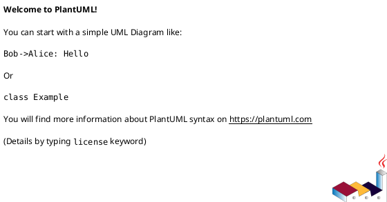

# REQUISITION FOR RESOURCE ALLOCATION (RRA-XXX)
**Status**: DRAFT / PENDING REVIEW
**Approver**: [USER]

## 1. Executive Summary

[Justificativa de 2-3 parágrafos explicando o valor de negócio da feature. Por que isso importa? Qual problema resolve?]

## 2. Architecture Views (PlantUML)

PlantUML Source

## 3. Technical Justification

### Allocators Impacted
- **Primary**: [Arena / GPA / Pool]
- **Secondary**: [Se aplicável]

### DOD Impact
- **SoA Structures**: [Quais structs serão convertidas para SoA]
- **System Changes**: [Quais sistemas serão modificados]
- **Memory Budget**: [Estimativa de uso de memória]

### Drift Check
- **Vibe Compliance**: [Como mantém estética retro]
- **Engine Constraints**: [Limitações do raycasting/2.5D]
- **Editor Separation**: [O que é engine vs editor]

## 4. Stakeholder Commentary

| Stakeholder | Commentary | Sentimento |
|-------------|------------|------------|
| **The Architect** | "" | 😐 / 😠 / 😄 |
| **Corporate HR** | "" | 😐 / 😠 / 😄 |
| **The Junior Dev** | "" | 😐 / 😠 / 😄 |
| **The Vibe Curator** | "" | 😐 / 😠 / 😄 |
| **The Retro Purist** | "" | 😐 / 😠 / 😄 |
| **The Engine Purist** | "" | 😐 / 😠 / 😄 |
| **The Avid Player** | "" | 😐 / 😠 / 😄 |
| **CEO** | "" | 😐 / 😠 / 😄 |
| **UX Lead** | "" | 😐 / 😠 / 😄 |
| **Lawyer** | "" | 😐 / 😠 / 😄 |
| **Lead Engineer** | "" | 😐 / 😠 / 😄 |

## 5. Implementation Timeline (Sprints)

- **Sprint 1**: [Fundação / POC]
  - [ ] [Task 1.1]
  - [ ] [Task 1.2]

- **Sprint 2**: [Refinamento / Integração]
  - [ ] [Task 2.1]
  - [ ] [Task 2.2]

- **Sprint 3**: [Polimento / Drift Analysis]
  - [ ] [Task 3.1]

## 6. Success Criteria

- [ ] [Critério 1]
- [ ] [Critério 2]
- [ ] [Critério 3]

## 7. Risks

| Risk | Likelihood | Impact | Mitigation |
|------|------------|--------|------------|
| [Risk 1] | Low/Med/High | Low/Med/High | [Mitigation] |

---

**Drafted By**: [Name]
**Date**: YYYY-MM-DD
**Last Updated**: YYYY-MM-DD
