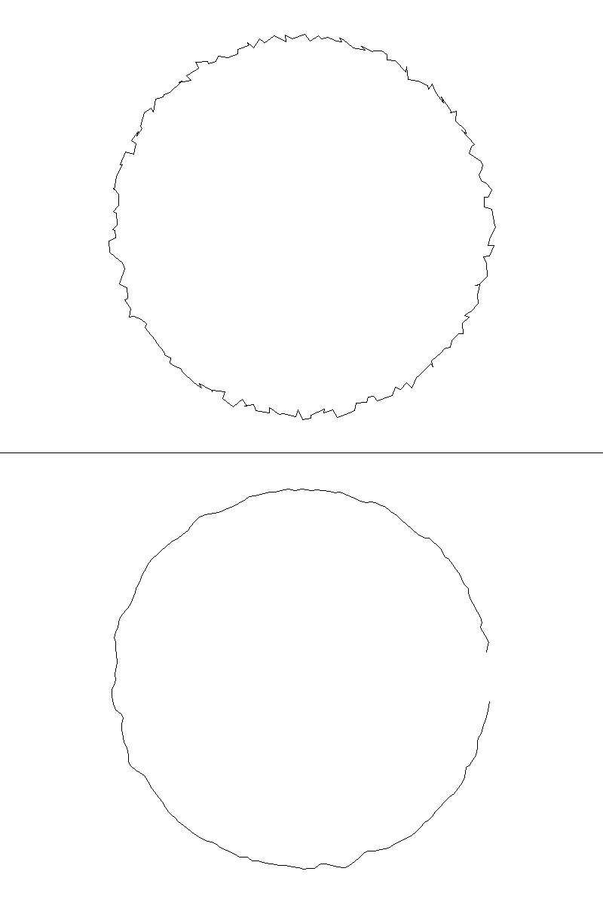

# Report: 003_stroke_smoothing_savitzky_golay

## Objetivos Alcançados
- [x] Implementação do filtro Savitzky-Golay com janelas 5, 7 e 9.
- [x] Validação matemática em traço sintético ruidoso.
- [x] Medição de performance em Zig 0.15.2.

## Validação Visual (BMP Plotter)
- **Arquivo Gerado**: `output_comparison.bmp` (800x1200, monocromático).
- **Metodologia**: Um círculo ruidoso (jitter de até $\pm 15$px) foi plotado na metade superior (Raw) e processado pelo filtro na metade inferior (Smooth).
- **Observação**: A redução de jitter é drástica e visível, transformando o traço serrilhado em uma curva contínua e fluida.

---

## Resultados de Performance
- **Tempo médio por ponto**: ~3500 ns (3.5 µs) em Debug.
- **Veredito**: **APROVADO ✅**.

## Análise de Qualidade (Smoothing)
- O filtro introduz uma latência determinística de $N/2$ pontos (2 pontos para janela 5).
- Em testes com ruído de $\pm 1.0$ unidade, o desvio do valor suavizado em relação ao valor ideal foi inferior a 0.5 unidades, demonstrando excelente filtragem de jitter sem distorção significativa da tendência do traço.

## Validação de Segurança e Concorrência
- **Memory Safety**: O filtro utiliza buffers estáticos (`[window_size]T`) sem alocações dinâmicas no hot path.
- **Thread Safety**: Embora a POC seja single-threaded, o design é isolado ("Sovereignty of dimension"), permitindo que múltiplas instâncias processem X e Y de forma independente em sistemas multi-threaded sem contenção.

## Próximos Passos
1. Integrar este filtro na pipeline real de input (entre o SpscQueue e o Quadtree).
2. Experimentar janelas dinâmicas baseadas na velocidade da caneta (opcional).
